# 🚀 SkillSync Pro: Intelligent Job Market Analyzer & Salary Predictor

[](https://www.python.org/)
[](https://streamlit.io/)
[](https://www.selenium.dev/)
[](https://scikit-learn.org/)

> **"Stop guessing what the market wants. Let the data decide."**

SkillSync Pro is an end-to-end Data Science application that automates the job market research process. It scrapes live job data, uses NLP to extract high-demand skills, and uses Machine Learning to estimate market value salaries based on candidate profiles.

## 🚀 Live Demo

**Try the live application here:** [SkillSync Pro · Streamlit](https://skillsyncpro.streamlit.app/)


---

## 📸 Project Demo

### 🎥 Application Workflow


---

## 🏗️ Architecture & Tech Stack

This project mimics a real-world Enterprise Data Pipeline, moving from raw unstructured data to a deployed analytical application.

| Component | Technology Used | Description |
| :--- | :--- | :--- |
| **Ingestion** | `Selenium`, `Python` | Custom web scraper with stealth mode (User-Agent rotation) to bypass bot detection. |
| **Storage** | `SQLite` | Relational database to store structured job listings. |
| **Processing** | `Pandas`, `Regex` | Data cleaning pipeline to parse "Experience" (e.g., "2-5 Yrs") and extract Tech Stacks. |
| **ML Engine** | `Scikit-Learn` | **Random Forest Regressor** trained on market logic to predict salaries based on skills. |
| **Frontend** | `Streamlit`, `Plotly` | Interactive web dashboard for data visualization and user interaction. |

---

### 🔄 Data Pipeline Flow

```mermaid
flowchart TD
    A[💻 Job Portals] -->|Selenium Scraping| B[🗃️ Raw HTML Data]
    B -->|Data Extraction| C[🧹 Clean Data]
    C -->|Store| D[(📦 SQLite DB)]
    D -->|Query| E[📈 Analytics Engine]
    E -->|NLP & Regex| F[🔑 Skills Extraction]
    F -->|ML Training| G[🤖 Salary Predictor Model]
    G -->|Visualize| H[🎉 Streamlit Dashboard]
    H -->|User Input| I[👥 Personalized Results]
```




## 📈 Project Stats & Metrics


## 🌟 Key Features

### 1. 📊 Live Market Insights
* **Real-time scraping:** The system fetches the latest jobs, ensuring data is never stale.
* **Skill Heatmaps:** Uses **Plotly** to visualize the most "in-demand" skills (e.g., distinguishing whether 'AWS' or 'Azure' is more popular in Bangalore).

### 2. 💰 AI Salary Predictor
* **The Problem:** Most job listings say "Salary Not Disclosed".
* **The Solution:** I used **Weak Supervision** to label the dataset based on market rules (Location + Experience + Skill Premium) and trained a Random Forest model.
* **The Feature:** Users input their experience and skills (Python, SQL, AWS) to get an estimated annual salary (LPA).

### 3. 📝 Smart Resume Matcher
* Uses **Set Theory** and **Keyword Matching** to compare a user's tech stack against specific job descriptions.
* Provides a "Match Score" and highlights missing critical skills.

---

## ⚙️ Installation & Usage

**1. Clone the Repository**
```bash
git clone [https://github.com/YOUR_USERNAME/SkillSync-Job-Analyzer.git](https://github.com/YOUR_USERNAME/SkillSync-Job-Analyzer.git)
cd SkillSync-Job-Analyzer


---

## 📸 Screenshots & Visuals

### Dashboard Preview
> Add your app screenshots here to showcase the UI/UX

---

## ✨ Why Choose SkillSync Pro?

| Feature | Traditional Job Search | SkillSync Pro ✅ |
|---------|----------------------|-------------------|
| Real-time Data | ❌ Manual Search | ✅ Automated Scraping |
| Salary Insights | ❌ Not Disclosed | ✅ AI-Powered Predictions |
| Skill Matching | ❌ Manual Comparison | ✅ Smart Algorithm |
| Market Trends | ❌ Limited View | ✅ Visual Heatmaps |
| Resume Analysis | ❌ Not Available | ✅ Intelligent Matcher |

---

## 👨‍💻 Author

**Harsh Choudhary**
- GitHub: [@HarshChoudhary2003](https://github.com/HarshChoudhary2003)
- Project Link: [SkillSync-Job-Analyzer](https://github.com/HarshChoudhary2003/SkillSync-Job-Analyzer)
- Live Demo: [https://skillsyncpro.streamlit.app/](https://skillsyncpro.streamlit.app/)

---

<div align="center">
  <b>If you found this project helpful, please consider giving it a ⭐!</b>
  <br>
  Made with ❤️ and Python
</div>
